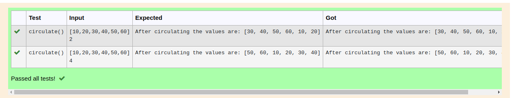

# Circulate-the-values-of-N-variables

## Aim:
To write a python program to circulate the n variables using function concept

## Equipment’s required:
PC
Anaconda - Python 3.7

## Algorithm: 
### Step 1: 
### Step 2: 
### Step 3: 
Get the value from the user for the number of rotation
### Step 4: 
Using the slicing concept rotate the list

### Step 5: 
### Step 6: 

## Program:
```
python
#Program to circulate N values.
#Developed by: K NIVETHA
#RegisterNumber:22009186
def circulate():
    circle=l[n:]+l[:n]
    print("After circulating the values are:",circle)
l=eval(input())
n=eval(input())
```

## Output:

## Result:
```
Hence the n variables are circulated
```
